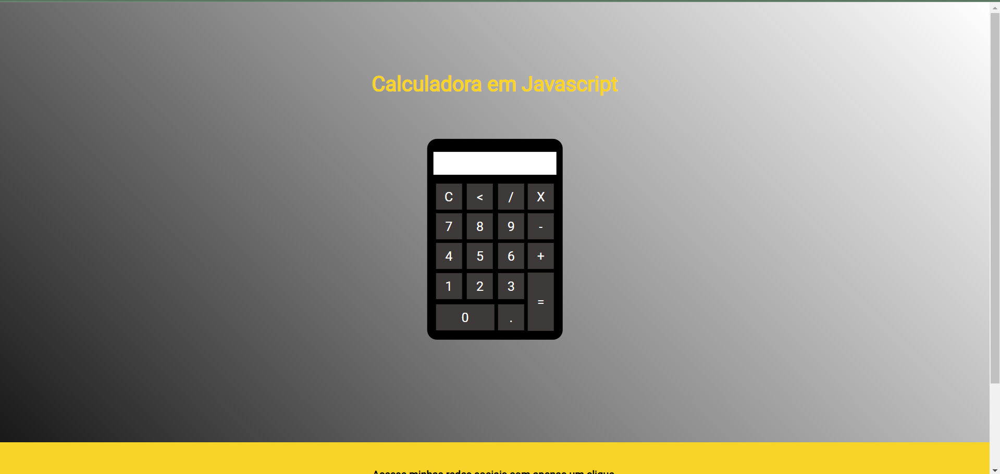

# 
 Calculadora em JavaScript 📱 

## Sobre 💻
Este calculadora web foi desenvolvida utilizando HTML, CSS e JavaScript e adicionada neste site. A calculadora permite realizar operações básicas, como adição, subtração, multiplicação e divisão, utilizando números inteiros e não-inteiros (tipo double).  
Acesse a calculadora clicando [aqui](https://www.tiagoroglio.com.br/calculator "https://www.tiagoroglio.com.br/calculator").

## Visualização do site 👁

Esta é a visualização da calculadora web. Ela foi desenvolvida como parte de um projeto totalmente educacional para praticar e aprimorar habilidades em desenvolvimento web, utilizando HTML, CSS e JavaScript. Desenvolvido principalmente para praticar os fundamentos da linguagem de programação JavaScript.  
Vale ressaltar que este site funciona em qualquer dispositivo, porém não foi desenvolvido pensado para o design responsivo.

## Tecnologias Utilizadas 🖱️ 
- HTML5
  - Este projeto utiliza de conceitos de criação de tabelas no HTML, utilizando as tags "&lt;tr&gt;" e "&lt;td&gt;" para estruturar a calculadora. Para o funcionamento do botão, foi adicionada a tag "&lt;button&gt;".
- CSS3
  - Este projeto utiliza de conceitos de posicionamento de elementos, como postiion absolute e translate para centralizar a calculadora no centro da tela, o que faz com que este site se torne responsivo, ajustando-se à qualquer tamanho de tela.
- JavaScript
   - Este projeto utiliza de conceitos básicos da linguagem de programação JavaScript, como criação de funções e a utilização de algumas funções default da linguagem. O código do arquivo `script.js` foi criado durante processo de aprendizagem, então possui algumas partes comentadas para auxiliar na fixação do conteúdo. 

O código JavaScript da calculadora está em um arquivo separado chamado `script.js`, o qual é importado no arquivo `index.html` para fornecer funcionalidades dinâmicas e interativas.

## Autor ✏️
- Tiago da Cunha Roglio
